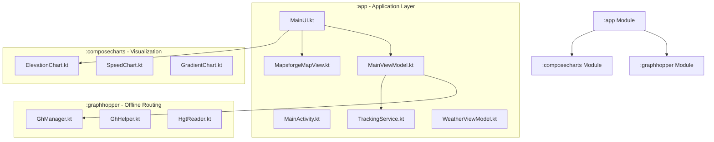

# 🗺️ Mapsforge Compose - Project Wiki

Welcome to the **Mapsforge Compose** developer and user wiki. This document provides an in-depth guide to the architecture, core modules, map rendering pipeline, offline routing engine, tracking service, and data integration.

---

## 📋 Table of Contents

1. [Overview & Key Features](#-overview--key-features)
2. [Architecture & Module Overview](#-architecture--module-overview)
3. [Core Subsystems](#-core-subsystems)
   - [1. Offline Map Rendering & Themes](#1-offline-map-rendering--themes)
   - [2. Offline Routing & Elevation (GraphHopper & DEM)](#2-offline-routing--elevation-graphhopper--dem)
   - [3. Background GPS Tracking & Service](#3-background-gps-tracking--service)
   - [4. Interactive Elevation & Speed Charts](#4-interactive-elevation--speed-charts)
   - [5. POI Management & Weather Integration](#5-poi-management--weather-integration)
   - [6. Cloud Data & Download Management](#6-cloud-data--download-management)
4. [Data Storage & Formats](#-data-storage--formats)
5. [Developer Setup & Build Guide](#-developer-setup--build-guide)

---

## 🚀 Overview & Key Features

**Mapsforge Compose** is a modern, high-performance Android application for outdoor navigation, GPX/KML track recording, offline routing, and elevation profile visualization. Built completely with **Jetpack Compose (Material 3)** and **Kotlin**, it pairs the **Mapsforge** vector rendering engine with the **GraphHopper** local routing library.

### Key Capabilities
- 🗺️ **100% Offline Vector Maps**: Mapsforge engine rendering vector `.map` files with full zoom and pan capability.
- 🎨 **Dynamic Render Themes**: Switch between themes (Cruiser, OutdoorActive, Mapsforge, Contrast) or import custom `.xml` map style sheets.
- 🚴 **Local Routing & Navigation**: Offline route generation for Walk, Bicycle, and Car using GraphHopper graphs and SRTM `.hgt` DEM elevation files.
- 📍 **Background GPS Tracking**: Foreground service (`TrackingService`) with battery-optimized location updates and real-time statistics (distance, climb, speed).
- 📊 **Elevation & Speed Profiles**: Custom Compose charts displaying track elevation, slope gradient percentages, and velocity.
- 🌧️ **Open-Meteo Weather**: Asynchronous forecast fetching powered by **Ktor** and **Kotlinx Serialization**.
- 📍 **POI Management**: Local Room database for saving Points of Interest, distance calculation, and sorting.
- 🌐 **GPX / KML Import & Export**: Full compatibility with standard outdoor track formats.

---

## 🏗️ Architecture & Module Overview

The project uses the **MVVM (Model-View-ViewModel)** architectural pattern with **Jetpack Compose** for rendering the UI and `StateFlow` for state management.



### Module Roles
- **`:app`**: Main entry point containing application UI, view models, Room databases, Ktor weather service, and background tracking service.
- **`:graphhopper`**: Encapsulates local GraphHopper route calculation, HGT Digital Elevation Model (DEM) parsing, and waypoint management.
- **`:composecharts`**: Independent Jetpack Compose library providing modular custom elevation, speed, and gradient profiles.

---

## 🛠️ Core Subsystems

### 1. Offline Map Rendering & Themes

Map rendering is handled by [MapsforgeMapView.kt](file:///C:/Users/altmi/AndroidStudioProjects/mapsforge_compose/app/src/main/java/com/almica/mapsforge_compose/MapsforgeMapView.kt), a custom Compose wrapper around the Mapsforge Android view.

- **Tile Sources**: Reads local `.map` binary tile files from internal/external storage.
- **Render Themes**:
  - Built-in theme presets: `Cruiser`, `Mapsforge`, `OutdoorActive`, `Contrast`, `SimplyHike`.
  - Custom Themes: Users can load external `.xml` theme folders. Handled by [ThemeDownloader.kt](file:///C:/Users/altmi/AndroidStudioProjects/mapsforge_compose/app/src/main/java/com/almica/mapsforge_compose/ThemeDownloader.kt).
- **Custom Overlays**:
  - `LatLngGridLayer`: Displays dynamic coordinate grid overlays (latitude/longitude lines).
  - Polyline layers for recorded tracks and GraphHopper routing paths.

---

### 2. Offline Routing & Elevation (GraphHopper & DEM)

Offline route calculation is implemented via the `:graphhopper` module and coordinated by [GhManager.kt](file:///C:/Users/altmi/AndroidStudioProjects/mapsforge_compose/app/src/main/java/com/almica/mapsforge_compose/gh/GhManager.kt).

- **Supported Profiles**: Pedestrian/Walk (`foot`), Bicycle (`bike`), and Car (`car`).
- **Roundtrip Routing**: Support for automatically generated roundtrips with customizable distance and seed parameters via `RoundtripValuePickerDialog.kt`.
- **DEM Altitude Profiles**: [HgtReader.kt](file:///C:/Users/altmi/AndroidStudioProjects/mapsforge_compose/app/src/main/java/com/almica/mapsforge_compose/gh/HgtReader.kt) parses standard SRTM `.hgt` files to attach exact elevation data to coordinates.

---

### 3. Background GPS Tracking & Service

GPS track recording is handled by [TrackingService.kt](file:///C:/Users/altmi/AndroidStudioProjects/mapsforge_compose/app/src/main/java/com/almica/mapsforge_compose/TrackingService.kt):

- **Foreground Service**: Ensures continuous tracking even when the app is minimized or the screen is locked.
- **Real-time Statistics**: Calculates live distance, current speed, average speed, elevation gain (ascent), and duration.
- **Persistence**: Saves route points into the Room database ([TourDatabase.kt](file:///C:/Users/altmi/AndroidStudioProjects/mapsforge_compose/app/src/main/java/com/almica/mapsforge_compose/TourDatabase.kt) and [TourEntity.kt](file:///C:/Users/altmi/AndroidStudioProjects/mapsforge_compose/app/src/main/java/com/almica/mapsforge_compose/TourEntity.kt)).
- **Import/Export**: [GpxUtils.kt](file:///C:/Users/altmi/AndroidStudioProjects/mapsforge_compose/app/src/main/java/com/almica/mapsforge_compose/GpxUtils.kt) and [KmlUtils.kt](file:///C:/Users/altmi/AndroidStudioProjects/mapsforge_compose/app/src/main/java/com/almica/mapsforge_compose/KmlUtils.kt) parse and export `.gpx` and `.kml` format files.

---

### 4. Interactive Elevation & Speed Charts

Located in `:composecharts` and integrated into [TourHistoryScreen.kt](file:///C:/Users/altmi/AndroidStudioProjects/mapsforge_compose/app/src/main/java/com/almica/mapsforge_compose/TourHistoryScreen.kt) and [MainUI.kt](file:///C:/Users/altmi/AndroidStudioProjects/mapsforge_compose/app/src/main/java/com/almica/mapsforge_compose/MainUI.kt):

- **[ElevationChart.kt](file:///C:/Users/altmi/AndroidStudioProjects/mapsforge_compose/app/src/main/java/com/almica/mapsforge_compose/charts/ElevationChart.kt)**: Plots distance vs. elevation with interactive touch scrubbing to inspect point elevation and coordinate position on the map.
- **[SpeedChart.kt](file:///C:/Users/altmi/AndroidStudioProjects/mapsforge_compose/app/src/main/java/com/almica/mapsforge_compose/charts/SpeedChart.kt)**: Plots distance vs. speed (km/h) with min/max/average indicators.
- **[GradientChart.kt](file:///C:/Users/altmi/AndroidStudioProjects/mapsforge_compose/app/src/main/java/com/almica/mapsforge_compose/charts/GradientChart.kt)**: Color-coded elevation profiles based on steepness gradient (flat, moderate, steep climb).

---

### 5. POI Management & Weather Integration

- **POI Database**: Room database ([PoiDatabase.kt](file:///C:/Users/altmi/AndroidStudioProjects/mapsforge_compose/app/src/main/java/com/almica/mapsforge_compose/PoiDatabase.kt)) stores custom waypoints and POIs.
- **POI Dialog**: [PoiListDialog.kt](file:///C:/Users/altmi/AndroidStudioProjects/mapsforge_compose/app/src/main/java/com/almica/mapsforge_compose/PoiListDialog.kt) allows sorting by name or current distance, direct navigation targeting, and weather lookup.
- **Weather Service**: [WeatherService.kt](file:///C:/Users/altmi/AndroidStudioProjects/mapsforge_compose/app/src/main/java/com/almica/mapsforge_compose/weather/WeatherService.kt) uses **Ktor Client** to query the Open-Meteo REST API.
- **Localization**: Full German (`values-de`) and English string resources.

---

### 6. Cloud Data & Download Management

Offline map tiles (`.map`), elevation grids (`.hgt`), and GraphHopper routing graphs are fetched via [MagentaCloud.kt](file:///C:/Users/altmi/AndroidStudioProjects/mapsforge_compose/app/src/main/java/com/almica/mapsforge_compose/externalData/MagentaCloud.kt) and [MapDownloader.kt](file:///C:/Users/altmi/AndroidStudioProjects/mapsforge_compose/app/src/main/java/com/almica/mapsforge_compose/MapDownloader.kt):

- Automatically detects available tile regions.
- Asynchronously downloads and extracts map packages directly to the app's local storage directory.

---

## 💾 Data Storage & Formats

| Data Type | Storage Mechanism / Format | File / Class Reference |
| :--- | :--- | :--- |
| **Vector Maps** | Binary `.map` files | Mapsforge Tile Specification |
| **Routing Graphs** | GraphHopper folder structure | `:graphhopper` module |
| **Elevation Data** | SRTM `.hgt` DEM files | `HgtReader.kt` |
| **Recorded Tours** | Room SQLite Database | `TourDatabase.kt`, `TourEntity.kt` |
| **POI Waypoints** | Room SQLite Database | `PoiDatabase.kt`, `PoiEntity.kt` |
| **App Settings** | Preferences / DataStore | `SettingsRepository.kt` |
| **Track Export** | `.gpx` XML, `.kml` XML | `GpxUtils.kt`, `KmlUtils.kt` |

---

## 🔧 Developer Setup & Build Guide

### Requirements
- **JDK**: 17+
- **Android Studio**: Ladybug (2024.2.1) or newer
- **Min SDK**: 26 (Android 8.0)
- **Target SDK**: 35 (Android 15)

### Build Commands
Run from terminal or PowerShell:
```bash
# Clean and assemble debug APK
./gradlew clean assembleDebug

# Run unit tests across all modules
./gradlew test

# Run code analysis
./gradlew lint
```
